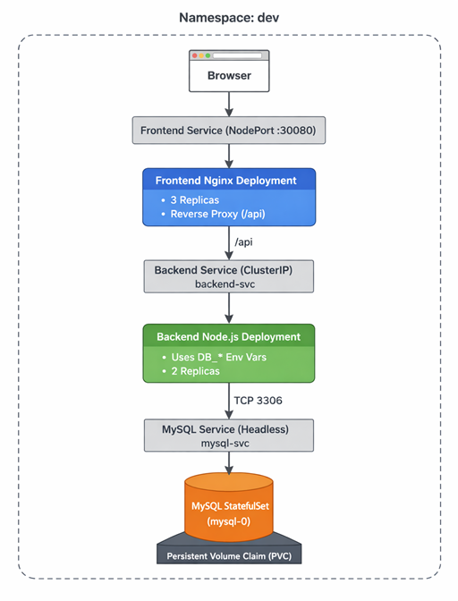
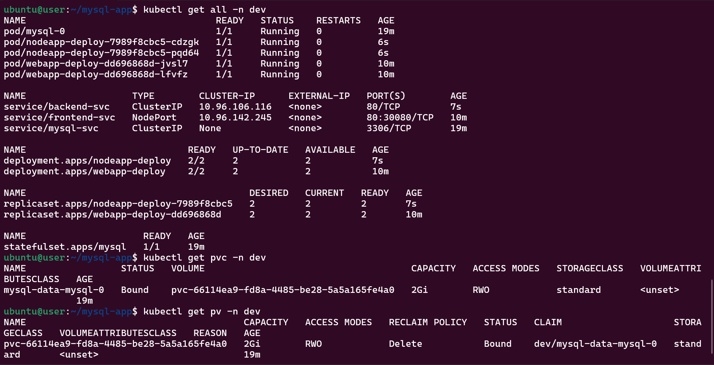
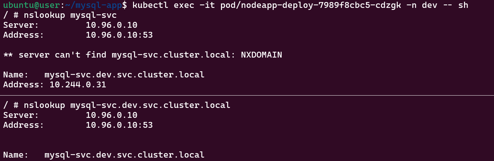

# ☸️ Kubernetes 3-Tier Application Architecture


### 📌 Project Overview

This project demonstrates a **basic 3-tier application architecture on Kubernetes** using:
- **Frontend:** Nginx (NodePort Service) with custom config
- **Backend:** Node.js (ClusterIP Service)
- **Database:** MySQL (StatefulSet with PVC, ConfigMap, Secret, Headless Service)

**👉 No business logic is implemented intentionally.**
The focus is purely on **Kubernetes concepts, networking, and service-to-service connectivity**.


### 🎯 Purpose of This Project

The main goals of this project are:
- Understand how **different Kubernetes components work together**
- Practice **real-world Kubernetes architecture patterns**
- Learn **service discovery using Kubernetes DNS**
- Understand **stateful vs stateless workloads**
- Learn how **ConfigMaps & Secrets** are injected into pods
- Validate **end-to-end connectivity** across layers
- This is a **learning or test project**, not meant for production.


### 🧠 What I Learned

- Namespace isolation
- StatefulSet vs Deployment
- Headless Service for databases
- NodePort vs ClusterIP services
- Environment variable injection using:
  - envFrom (Database)
  - env + valueFrom (Backend)
- Persistent storage using PVC
- Internal DNS resolution in Kubernetes
- Debugging connectivity issues step-by-step


### 🏗️ Architecture Diagram (Logical View)




### 🧩 Components Breakdown

**1. Frontend**
- **Deployment:** `webapp-deploy`
- **Image:** `nginx:1.28-alpine`
- **Service:** NodePort (`30080`)
- **Purpose:** Entry point for users

**2. Backend**
- **Deployment:** `nodeapp-deploy`
- **Image:** `node:20-alpine`
- **Service:** ClusterIP (`backend-svc`)
- **Purpose:** Acts as middle layer, connects to DB

**3. Database**
- **StatefulSet:** `mysql`
- **Image:** `mysql:8.0`
- **Service:** Headless (`mysql-svc`)
- **Storage:** PVC
- **Config:**
  - ConfigMap → DB name, user
  - Secret → DB passwords


### Deployment Steps

**1. Create Namespace**
```sh
kubectl apply -f namespace.yaml
```

**2. Deploy Database layer (Database must be ready before backend)**
```sh
kubectl apply -f database.yaml

# Verify resources
kubectl get pods -n dev
kubectl get svc -n dev
kubectl get pvc -n dev
```

**3. Deploy Backend layer (Backend depends on database)**
```sh
kubectl apply -f backend.yaml

# Verify resources
kubectl get pods -n dev
kubectl get svc -n dev
```

**4. Deploy Frontend layer (Frontend depends on backend)**
```sh
kubectl apply -f frontend.yaml

# Verify resources
kubectl get pods -n dev
kubectl get svc -n dev
```

**5. Verify All Resources**
```sh
kubectl get all -n dev
kubectl get pvc -n dev
kubectl get pv -n dev
```




### 🔍 Verifying Connectivity (Important Part)

**1. Database Verification**
```sh
kubectl exec -it mysql-0 -n dev -- mysql -uappuser -p

# Check Database
SHOW DATABASES;
```


**2. Backend → Database Connectivity**
```sh
kubectl exec -it <backend-pod> -n dev -- sh

# Install Client
apk update
apk add --no-cache mysql-client

# Connect to database
mysql -h mysql-svc -uappuser -p mysqldb --ssl=0
```



**3. Backend Service Discovery**
```sh
kubectl exec -it <backend-pod> -n dev -- nslookup mysql-svc
```

**4. Frontend Access**
```sh
http://<NODE-IP>:30080

# Verify locally
curl http://<NODE-IP>:30080
```
> - Nginx is configured as a reverse proxy using a ConfigMap.
> - Requests to /api are forwarded to the backend ClusterIP service (backend-svc).


### 🧪 Debugging Tips

| Problem           | Command                      |
| ----------------- | ---------------------------- |
| Pods not ready    | `kubectl describe pod <pod>` |
| DNS issue         | `nslookup service-name`      |
| Logs              | `kubectl logs <pod>`         |
| Env check         | `kubectl exec pod -- env`    |
| Service endpoints | `kubectl get endpoints`      |


### ⚠️ Known Limitations

- No real application logic
- Backend runs dummy process (`sleep`)
- No TLS between services
- No Ingress controller
- No autoscaling

These are `intentional`, to keep focus on `core Kubernetes concepts`.


### 💡 Future Improvements

- Add real Node.js backend
- Add readiness & liveness probes
- Use Ingress instead of NodePort
- Enable MySQL TLS
- Add HPA (Horizontal Pod Autoscaler)
- Add CI/CD pipeline